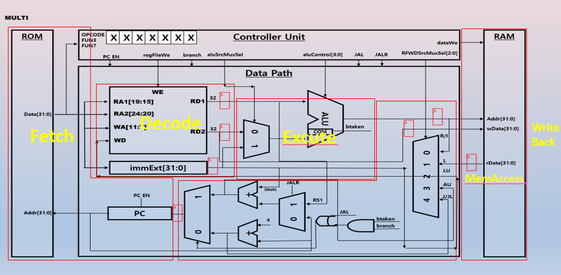

## 📖 프로젝트 개요

본 저장소는 현대 CPU 아키텍처의 핵심 구성 요소들을 체계적으로 분석하고 구현한 **종합적인 컴퓨터 구조 연구 프로젝트**입니다.
산술 회로부터 파이프라인 프로세서까지, 컴퓨터 시스템의 가장 근본적인 동작 원리를 깊이 있게 탐구합니다.

## 🏗️ 아키텍처 구성 요소

### **🔢 기초 구성 블록**
- **산술 회로 (Arithmetic Circuits)** - 연산의 기본 단위
- **수 체계 (Number Systems)** - 디지털 표현의 수학적 기반
- **순차 논리 블록 (Sequential Building Blocks)** - 시간에 따른 상태 변화

### **💾 메모리 시스템**
- **메모리 배열 (Memory Arrays)** - 데이터 저장의 물리적 구현
- **메모리 맵 (Memory Map)** - 주소 공간의 체계적 구성

### **⚙️ 프로세서 아키텍처**
- **어셈블리 언어 (Assembly Language)** - 하드웨어와의 직접적 소통
- **기계어 (Machine Language)** - 실리콘이 이해하는 언어
- **아키텍처 상태와 명령어 집합** - 프로세서의 정신적 모델

### **🔄 제어 및 데이터 경로**
- **단일 사이클 데이터패스** - 명령어 실행의 기본 흐름
- **단일 사이클 제어 유닛** - 간결함 속의 완성도
- **멀티사이클 아키텍처** - 효율성을 위한 복잡성
- **파이프라인 프로세서** - 성능 극대화의 정점

## 🏗️ 명령어 Type별 데이터 경로
### **기본 데이터패스 구조**
<table>
<tr>
<td width="50%">

**DataPath**
![DataPath]
*기본 파이프라인 데이터패스의 전체 구조*

</td>
<td width="50%">

**BType 명령어**

*분기 명령어의 데이터 흐름*

</td>
</tr>
</table>

### **레지스터 및 즉시값 명령어**
<table>
<tr>
<td width="50%">

**R-Type 명령어**

*레지스터 간 연산 명령어*
- ADD, SUB, AND, OR, XOR
- 두 개의 소스 레지스터 사용
- 결과를 목적지 레지스터에 저장

</td>
<td width="50%">

**I-Type 명령어**

*즉시값 연산 명령어*
- ADDI, ANDI, ORI, XORI
- 하나의 소스 레지스터와 즉시값
- 로드 명령어 포함

</td>
</tr>
</table>

### **메모리 및 점프 명령어**
<table>
<tr>
<td width="50%">

**L-Type 명령어 (Load)**

*메모리 로드 명령어*
- 메모리에서 레지스터로 데이터 전송
- 주소 계산 및 메모리 액세스
- 데이터 캐시와의 상호작용

</td>
<td width="50%">

**S-Type 명령어 (Store)**

*메모리 저장 명령어*
- 레지스터에서 메모리로 데이터 전송
- 주소 계산 및 쓰기 동작
- 메모리 일관성 유지

</td>
</tr>
</table>

## 🎯 학습 목표

이 프로젝트를 통해 다음과 같은 심화 이해를 도모합니다:

- **하드웨어 추상화**의 계층적 구조 파악
- **성능과 복잡성** 사이의 엔지니어링 트레이드오프 분석
- **병렬 처리**의 근본적 원리와 한계점 이해
- **현대 프로세서** 설계의 핵심 개념 습득

## 🚀 기대 효과

- **컴퓨터 시스템**에 대한 통합적 시각 획득
- **성능 최적화**를 위한 하드웨어 수준의 이해력 향상
- **차세대 아키텍처** 설계를 위한 견고한 토대 구축

---

*"CPU 아키텍처는 단순히 회로의 조합이 아닌, 인간의 사고를 실리콘 위에 구현한 지적 창조물입니다."*
